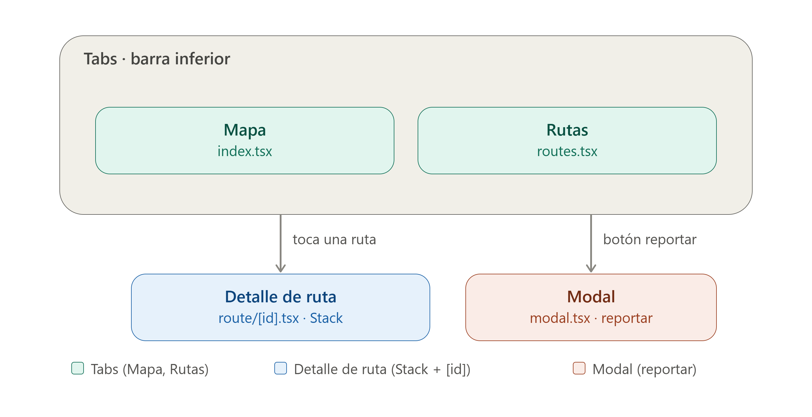

# Arquitectura de Navegación — CampusRuta (Expo Router)

## 1. Wireframe de Navegación

**Concepto de la app:** *CampusRuta*, una app para consultar las rutas de transporte/movilidad de una ciudad universitaria (rutas de bus del campus, mapa y detalle de cada ruta).

### Decisiones de diseño (Fase 1)

| Pregunta | Respuesta | Justificación |
|---|---|---|
| Pantallas en Tabs | **Mapa** (vista general con todas las rutas activas) y **Rutas** (listado de rutas disponibles) | Son las dos formas principales de explorar la información: visual (mapa) y textual (lista), y el usuario alterna entre ambas constantemente → acceso permanente en la barra inferior. |
| Pantalla jerárquica (Stack, con botón de regreso) | **Detalle de Ruta** | Se llega a ella *desde* la lista de Rutas o al tocar un trazado en el Mapa; el usuario consulta horarios/paradas y espera volver atrás de forma natural. Es el flujo clásico de "profundizar y regresar" de un Stack. |
| Pantalla con ruta dinámica `[id]` | La misma **Detalle de Ruta**, ubicada en `route/[id].tsx` | Cada ruta universitaria tiene un identificador único (ej. Ruta 1 - Norte, Ruta 2 - Centro); la pantalla no tiene sentido sin ese parámetro, así que el `id` va en la URL y no en un estado global. |
| Flujo que justifica un Modal | **Reportar una incidencia** (bus demorado, ruta cancelada, parada bloqueada) | Es una acción corta y puntual que el usuario dispara desde cualquier pantalla sin perder su lugar en la navegación; no tiene "hijos" ni forma parte de la jerarquía, por lo que se presenta flotando sobre la pantalla actual en vez de apilarse en el Stack. |

### Diagrama (descripción del wireframe)

```
┌─────────────────────────┐        ┌─────────────────────────┐
│          MAPA            │        │          RUTAS           │
│  (Tab 1 - index.tsx)     │        │  (Tab 2 - routes.tsx)    │
│  Mapa del campus con      │        │  Lista de rutas           │
│  trazados de cada ruta    │        │  disponibles (1, 2, 3...) │
│  [⚠] → abre Modal         │        │                           │
│  [trazado] → push a detalle│       │  [ruta] → push a detalle  │
└────────────┬─────────────┘        │  (mismo patrón)           │
             │                       └────────────┬──────────────┘
             │  router.push('/route/[id]')          │
             ▼                                      │
   ┌───────────────────────────┐                     │
   │   DETALLE DE RUTA           │◄────────────────────┘
   │   route/[id].tsx (Stack)    │
   │   useLocalSearchParams()    │
   │   muestra: "Consultando     │
   │   la ruta con id: {id}"     │
   │   + paradas y horarios      │
   │   ← botón de regreso        │
   └───────────────────────────┘

          (desde MAPA o RUTAS, botón "⚠ Reportar")
                       │
                       ▼
            ┌───────────────────────────┐
            │           MODAL             │
            │   modal.tsx                  │
            │   presentation: 'modal'      │
            │   Formulario de incidencia:  │
            │   tipo, ruta afectada, nota  │
            │   [Enviar] [Cancelar]        │
            └───────────────────────────┘
```


---

## 2. Explicación del Flujo

La navegación se organiza en tres capas coordinadas por el **Root Layout** (`app/_layout.tsx`), que registra un `<Stack/>` principal:

1. **Grupo `(tabs)`**: es la primera pantalla que ve el usuario al abrir la app. Dentro de él, `_layout.tsx` define el Tab Navigator con dos pestañas — *Mapa* y *Rutas* — cada una con su ícono y título. Este grupo entra al Stack principal como una sola entrada (el usuario no "regresa" de una pestaña a otra, solo cambia de pestaña para ver la misma información de forma visual o listada).

2. **Ruta dinámica `route/[id].tsx`**: desde el Mapa (tocando un trazado) o desde la lista de Rutas (tocando un ítem), se llama a `router.push('/route/2')` (navegación programática) o se usa un `<Link>` (navegación declarativa). Expo Router interpreta el segmento `2` como el parámetro `id`, y la pantalla lo recupera con `useLocalSearchParams()` para mostrar los datos de esa ruta específica: paradas, horarios y frecuencia. Como esta pantalla se apila sobre el Stack raíz, aparece con animación de "entrar desde la derecha" y botón de regreso automático — coherente con que el usuario vino "a consultar algo puntual" desde el mapa o la lista.

3. **Pantalla Modal**: desde el Mapa o desde el detalle de una ruta, el botón "⚠ Reportar" usa un `<Link href="/modal">` para abrir `modal.tsx`. En el Root Layout, esta ruta está registrada con `options={{ presentation: 'modal' }}`, lo que hace que el Stack la presente deslizándose desde abajo, sin botón de regreso tradicional. Esto refuerza visualmente que reportar una incidencia es una acción puntual y transversal (se puede disparar desde cualquier pantalla) y no un paso más en la jerarquía de navegación entre Mapa → Rutas → Detalle.

4. **`+not-found.tsx`**: actúa como red de seguridad; si se intenta acceder a una ruta que no existe (por ejemplo, un `id` de ruta inválido en un deep link, o un enlace roto), el Stack raíz redirige aquí en lugar de romper la app.

En resumen: las **Tabs** resuelven el "¿cómo quiero ver la información en general, mapa o lista?", el **Stack + ruta dinámica** resuelve el "quiero ver el detalle de una ruta específica", y el **Modal** resuelve el "quiero reportar algo rápido sin perder mi lugar en el mapa o la lista".

---

## 3. Comparativa Técnica (Análisis con IA)

**Prompt utilizado:** el indicado en la Fase 3, actuando como "Arquitecto Senior de Software en React Native", aplicado sobre el árbol de carpetas del proyecto:

```
app/
├── (tabs)/
│   ├── _layout.tsx
│   ├── index.tsx        # Mapa
│   └── routes.tsx       # Rutas
├── route/
│   └── [id].tsx         # Detalle de ruta (dinámico)
├── modal.tsx             # Reportar incidencia
├── _layout.tsx
└── +not-found.tsx
```

### Resumen del análisis obtenido

**a) Separación de conceptos (rutas de navegación vs. lógica de negocio)**
En el estado actual del proyecto, `app/` mezcla dos responsabilidades: define *qué pantallas existen y cómo se navega entre ellas* (correcto, es su función con Expo Router) pero también contiene, dentro de cada archivo `.tsx`, la lógica de fetching de datos (ej. traer las rutas de bus desde una API o un JSON local), el manejo del estado del mapa (marcadores, región visible, permisos de ubicación) y los estilos. Es aceptable en un proyecto pequeño o educativo, pero no escala bien: a medida que se agreguen más rutas universitarias, filtros (por facultad, por horario) o integración con GPS en tiempo real, esa lógica termina duplicada o enterrada dentro de archivos que deberían limitarse a "enrutar".

*Nota de terminología:* en este análisis, "ruta" se usa con dos sentidos distintos que conviene no confundir — **ruta de navegación** (el path de Expo Router, ej. `route/[id]`) y **ruta universitaria** (el recorrido de transporte del campus, ej. "Ruta 2 - Centro"), que es un dato del dominio, no parte del árbol de `app/`.

**b) Arquitectura alternativa: Feature-First con `/src`**
La propuesta consiste en dejar `app/` casi vacío de lógica, usándolo solo como capa de enrutamiento, y mover todo lo demás a una carpeta `/src` organizada por *feature* (dominio funcional) en lugar de por tipo de archivo:

```
src/
├── features/
│   ├── campus-map/
│   │   ├── components/     # Marcadores, overlays de trazados
│   │   ├── hooks/           # useMapRegion, useLocationPermission
│   │   ├── services/        # fetch de trazados/geoJSON
│   │   └── types.ts
│   └── routes/               # dominio "rutas universitarias"
│       ├── components/       # RouteCard, StopList, ScheduleTable
│       ├── hooks/            # useRouteDetail, useRoutesList
│       └── services/         # API de rutas, horarios
├── shared/
│   ├── components/
│   ├── hooks/                # useReportIncident (usado por el modal)
│   └── theme/
└── app/            (entry points que la carpeta /app de Expo Router importa)
```

Cada archivo dentro de `app/` (por ejemplo `app/route/[id].tsx`) pasaría a ser una capa muy delgada que solo importa y renderiza la pantalla real definida en `src/features/routes/`.

**c) Ventajas de migrar**
1. **Cohesión por dominio:** todo lo relacionado con "rutas universitarias" o con "mapa" (componentes, hooks, llamadas a API, tipos) vive junto, facilitando encontrar y modificar código sin saltar entre carpetas dispersas.
2. **Testabilidad y reutilización:** al separar la lógica de negocio de la definición de rutas, es más fácil escribir tests unitarios sobre `src/features/*` sin depender del sistema de enrutamiento, y reutilizar esos componentes en otra pantalla o incluso en otro proyecto.

**d) Desventajas de migrar**
1. **Sobrecarga de complejidad inicial:** para un proyecto pequeño o un MVP, introducir una segunda carpeta raíz y una capa de indirección (archivo de ruta que solo re-exporta un componente de `/src`) puede sentirse como *over-engineering* y ralentizar el desarrollo.
2. **Curva de aprendizaje del equipo:** exige disciplina para no volver a mezclar lógica dentro de `app/` "por comodidad", y requiere que todo el equipo entienda y respete la convención Feature-First, algo más difícil de mantener en equipos pequeños o con alta rotación.

### Conclusión personal

En un proyecto de gran escala sí aplicaría la arquitectura Feature-First con `/src` porque el costo de la indirección extra se paga solo una vez mientras que los beneficios de cohesión testabilidad y escalabilidad se multiplican con cada nueva funcionalidad y con cada desarrollador que se suma al equipo Sin embargo para un proyecto personal o un prototipo como el de esta actividad mantener la lógica directamente dentro de `app/` es razonable: la prioridad en esa etapa es la velocidad de iteración no la escalabilidad a largo plazo La clave está en reconocer el punto de inflexión  cuando el número de pantallas y features empieza a generar fricción real  y migrar antes de que la refactorización se vuelva costosa.